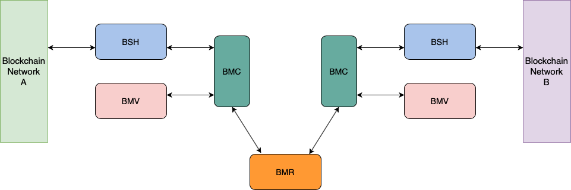

# Overview

## Cross-Chain Interoperability - Blockchain Transmission Protocol (BTP)

A secured and distributed database architecture, the blockchain, has been introduced and launched for ten years. A great number of cryptocurrency and its ecosystem, competing to become the de-facto blockchain, has also been enriched over time. However, they are still merry-go-round on the old-traditional path of development which, in fact, makes this industry, as a whole, evolve into a series of stand-alone and disconnected pieces. Apparently, that's a major problem and we call it a "lack of interoperability" in the blockchain ecosystems today.

In the traditional fiat-currency trading system, the payment infrastructures can be operated interoperably. Regardless of what currency and geographic location, goods, and services can simply be paid by swiping a debit or credit card. Interoperability simply means "borderless communication" in which two or more distinctive ecosystems can communicate and exchange their value to each other. Along with the development of the blockchain's full potential, we want distinct protocols to have compatible ways to interact and communicate with each other, and the ability to interoperate at the protocol level. Thus, ICON Network has set out on a mission to "hyperconnect the world". We are excited to share the latest technology advancements and details around ICON's interoperability solution, which is called Blockchain Transmission Protocol (BTP), with our community.

The infrastructure of BTP consists of four components:

* BTP Service Handler (BSH): a smart contract that holds application-specific logic (i.e. Coins, Tokens, and NFTs transferring among networks)
* BTP Message Verifier (BMV): a smart contract that takes responsibility to verify messages being sent to the Message Center
* BTP Message Center (BMC): a smart contract that aggregates BTP Messages on a given network
* BTP Message Relay (BMR): clients that pass messages between Message Centers

The Blockchain Transmission Protocol (BTP) is unique amongst existing interoperability solutions. In our design, BMRs do not need to be trusted. In fact, they only take responsibility for passing relayed information between two connected blockchains to ensure the liveliness of the BTP Network. At the first stage, it plans to launch with centralized Relays, operated and managed by ICON, to test a feasibility of the design and to assure the network can be run smoothly. In the long run, ownership of Relays will be decentralized using a Proof of Stake method. The security and reliability of the Blockchain Transmission Protocol (BTP) entirely rely on a set of three types of smart contracts (BSH, BMV, and BMC) on each connected network. The significant security checkpoint of the BTP Network is the Message Verifier contract (BMV). Other interoperability solutions rely on the trust of Relays/Validators or some sort of game theories. However, this proposing BTP scheme maintains its security and reliability through cryptography which provides more robustness and trustworthiness.

## BTP Interoperability Example:

.png>)

In the last couple of years, Decentralized Finance (DeFi) has been gaining more attention. DeFi is a global and open financial system, built for the new era of the Internet, in which it strives to alternate traditional finance systems that are held and controlled by old infrastructures. With that aspiration, a great use case of the Blockchain Transmission Protocol (BTP) would be Tokens/Coins transfers among different blockchains. At the protocol level, the BTP facilitates such a request directly through smart contracts, from one chain to another without using a central trading platform. In this example, Polkadot Parachains will be used to demonstrate. For a sake of simplicity, the above diagram, which describes an interoperability use case of BTP, can be broken down into steps as following:

* On ICON's side, Bob sends `100 ICX` to the _BTP Service Handler_ (BSH) contract
* A small fee (`1 ICX`) is being charged and sent to the _Fee Aggregation_ contract in this example
* The _BSH_ contract locks the `99 ICX`, then sends a transferring service message to the _BTP Message Center_ (BMC) on ICON
* _BTP Message Relay_ (BMR) reads the message, that was thrown by Message Center on ICON, containing information that `99 ICX` was locked in the _BSH_ contract
* _BMR_ collects requiring data, builds `Relay Message`, then sends it to the _BTP Message Center_ (BMC) on the Parachain
* Upon receiving a message, _BMC_ forwards it to _Message Verifier_ (BMV) for going through a procedure of attestation
* _BMV_ contract either approves or rejects this requested message
* Assuming this request is approved by the _BMV_ contract, the _BMC_ will then forward the approved message to the _BTP Service Handler_ on the Parachain.
* Upon receiving a request, _BSH_ contract will mint `99 ERC1155_ICX` (a wrapped Token of `ICX` on the Parachain) and send to Bob's wallet.
